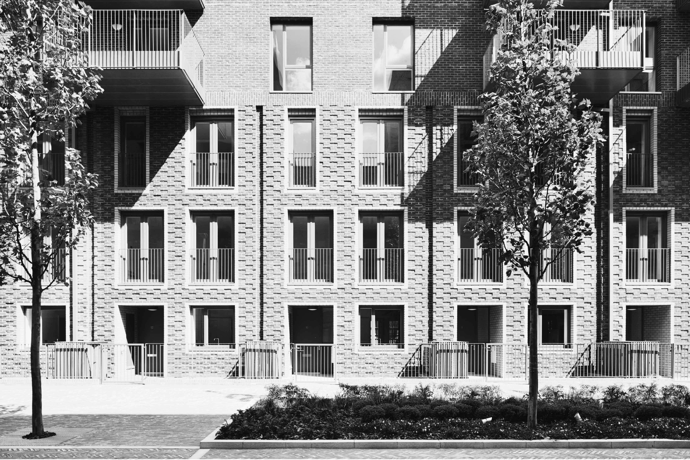

---
### Required
title: "Computing objections"
subtitle: "Part 1: London's housing crisis and how natural language processing can help"
date: 2025-19-05
authors: 
- Beatrice Taylor
summary: 'Planning objections are often blamed for slowing housebuilding. But what do those objections actually say? This is the first post in a series using natural language processing to find out.'
draft: false
featured: true
tags:
- Housing
- Machine Learning
# Projects linkage
projects: ['ai4ci']
url_code: ''
url_pdf: ''
url_slides: ''
url_video: ''
---

Every year, thousands of Londoners sit down at their computers and write to their local council about a building going up nearby. Some are angry. Some are thoughtful. Some are both. In this project, we're reading all of them — and using machine learning to understand what they actually say.

The UK government has set an ambitious target of building 1.5 million homes, equivalent to 81,000 new homes per year in London. But the planning system is notoriously slow, and new housing is routinely delayed by community objections. These objections are often written off as NIMBYism, the preservationist attitude of "not in my backyard." In this project we are using natural language processing to extract information from the text of community comments on planning applications in London, with the goal of understanding what people object to, and what this might tell us about what housing is actually needed.

This is the first in a series of blog posts documenting our work, which is part of the broader [AI for collective intelligence (AI4CI) Smart Cities](https://ai4ci.ac.uk/themes/smart-city-design/) research. In this first post we provide some background context, and explain why we think a data-driven analysis could be particularly illuminating.

# The housing crisis

## Polycrisis and housing demands

Given its ever-present coverage in the British media, I'm sure anyone reading this knows there is a housing crisis in the UK — one that is particularly severe in London, where the average home costs [11 times the average annual salary](https://www.ons.gov.uk/peoplepopulationandcommunity/housing/bulletins/housingaffordabilityinenglandandwales/2024). This crisis doesn't exist in isolation. It is tangled up with inequality, austerity, and the climate emergency — part of what researchers call a "polycrisis," where multiple, interconnected crises compound one another. We discussed some of the impacts on housing in our previous post on the [crisis in permanent accommodation](https://citymodellinglab.uk/blog/posts/small_council_housing/small_council_housing.html).

{.float-right}

The government has determined that the best way to address this is to increase supply of new private housing, based on the theory that more homes will bring prices down, allowing more people to exit the rental market and freeing up rental stock for those on lower incomes. Whether this strategy works depends heavily on the right type of housing being built — in the right locations, at the right sizes, with the right tenures — none of which is specified in government targets. Even setting that debate aside, the targets look very unlikely to be met: London's housing construction peaked at [32,000 new homes in recent years](https://www.centreforcities.org/publication/restarting-housebuilding-planning-reform-and-the-private-sector/), less than half of what is needed.

So why aren't more homes being built? The causes are numerous. Developers face increasing costs of raw materials and a shortage of skilled labour following Brexit. There is also the practice of "land banking" — where developers sit on land with planning permission and release new homes onto the market slowly, rather than building all at once, which keeps prices artificially high. Without significant national policy change, the government has limited levers to pull on either of these. In the meantime, responsibility for slow construction tends to get directed at the planning system.

## The UK planning system

The UK planning system is remarkably analogue for something that shapes so much of daily life. Planning applications are submitted to the relevant local planning authority, who review the documentation and come to a judgement in line with both local and national planning policy. Delayed approvals are an enduring feature of the system, making it easy to [point the finger at planners for holding up house building](https://www.bbc.co.uk/news/articles/cgmzwk4yd1eo).

{.float-left}

One part of the process that often draws criticism is community consultation. Under the Town and Country Planning Act, planning authorities are required to make applications available for public comment. These comments — formally called "representations" — are submitted through online planning portals: essentially public forums where anyone can log in and have their say. The formal/informal distinction matters here: representations are legally part of the planning process, not just feedback. They are reviewed by planning officers, classified as either "material" (relevant to the public interest) or "non-material" (concerning private matters), and summarised for consideration when a final judgement is made.

## NIMBYism

Community comments are typically framed as a form of NIMBYism — a term used pejoratively to describe opposition to new developments, particularly housing, based on a desire to preserve the status quo. NIMBYism is often associated with selfish, parochial attitudes, and it maps neatly onto broader political debates about housing, property, and the role of the state.

{.float-right}

But that framing isn't the whole story. Others have interpreted community comments as a form of participatory democracy - residents using a formal channel to articulate what they want the built environment around them to look like. This interpretation has shaped how we approach this project. Looked at in aggregate, do the comments capture something like a collective vision for the city? That question has interesting links to collective intelligence: how does a group of individual voices, filtered through a bureaucratic process, add up to something meaningful?
<!-- 
Spoiler: not everyone objecting to a new development is simply trying to protect their property values. -->

# Data-driven analysis of community comments

## Big data in planning

We live in an era of big data, and planning applications are a rich and largely untapped source of it. There are vast quantities of digital files and web pages relating to every proposed building change in the country whether approved, rejected, or stuck in bureaucratic limbo. Historically, analysing text data at this scale required extensive qualitative work: researchers reading through hundreds of comments by hand. Natural language processing (NLP) has changed that. We can now run quantitative, data-driven analysis on tens of thousands of comments, extracting patterns that would be invisible to any individual reader.

  <strong>What is natural language processing?</strong> 
  
  NLP is a field of computer science that gave rise to large language models like ChatGPT. It refers to methods for extracting numerical information from text — typically by encoding sentences as vectors of numbers called embeddings. These vectors can then be used for all kinds of downstream analysis, such as measuring the sentiment of a text, grouping similar documents together, or identifying the main topics in a large corpus. In our case, we're using NLP to analyse the themes and sentiment in community comments on planning applications.

## AI in planning

Central government is actively modernising the planning system, with [recent planning reform](https://www.gov.uk/government/publications/planning-reform-working-paper-speeding-up-build-out/planning-reform-working-paper-speeding-up-build-out) and growing investment in "proptech" (property technology) — a sector where small private firms are using AI to automate various parts of the planning process. Our project engages with this moment, though from a research angle: we're interested in what the content of community comments can tell us, not just how to process them more efficiently. Longer term, we hope to build on our findings to develop tools that make this kind of analysis accessible to planners, researchers, and communities themselves.

## Our work

In this project we are using NLP to extract information from the text of community comments on residential planning applications in London. We are interested in understanding what people object to about proposed developments, and how this varies across different types of development and different parts of the city. We are also interested in how the content of comments varies depending on who is writing them — local residents versus people from further afield, for instance. In this series of blog posts we will be documenting the technical aspects of our work as we go, and sharing what we find.

In the next post, we'll get into the data itself: where it comes from, what it looks like, and some of the challenges of working with it at scale.

---------------------------------

You can read more about AI4CI Smart Cities [here](https://ai4ci.ac.uk/themes/smart-city-design/) or check out our GitHub page [here](https://github.com/AI4CI-smart-cities). Thanks to my AI4CI colleagues Adam Dennett and Adham Enaya.