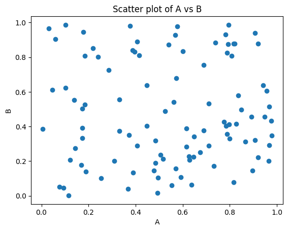

<details>
<summary>Show Code</summary>

```python
import pandas as pd
import numpy as np
# generate a bunch a random number
data = pd.DataFrame(
    {
        'A': np.random.rand(100),
        'B': np.random.rand(100)
})
print(data)
# Jaja

```

</details>

               A         B
    0   0.493174  0.017802
    1   0.030246  0.966530
    2   0.808079  0.808019
    3   0.732224  0.172192
    4   0.849374  0.496186
    ..       ...       ...
    95  0.794057  0.873973
    96  0.638147  0.063281
    97  0.648956  0.341507
    98  0.331695  0.554998
    99  0.941032  0.637759
    
    [100 rows x 2 columns]


### Markdown!

##### Another


<details>
<summary>Show Code</summary>

```python
### Plot something
import matplotlib.pyplot as plt
plt.scatter(data['A'], data['B'])
plt.xlabel('A')
plt.ylabel('B')
plt.title('Scatter plot of A vs B')
plt.show()
```

</details>


    

    

